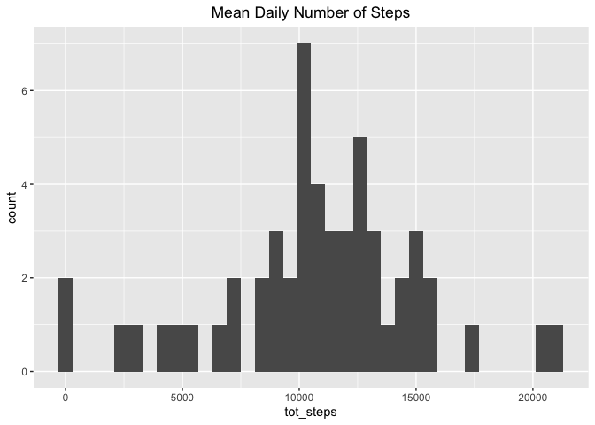
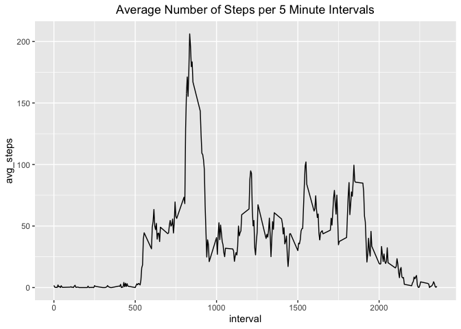
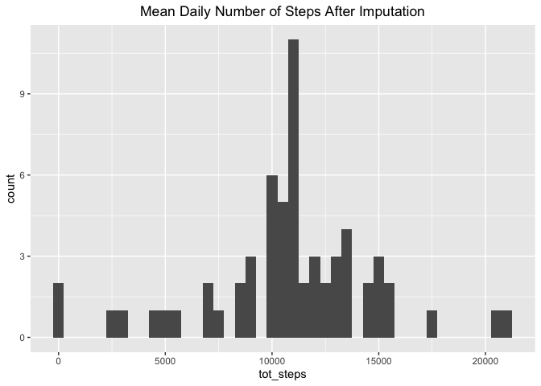
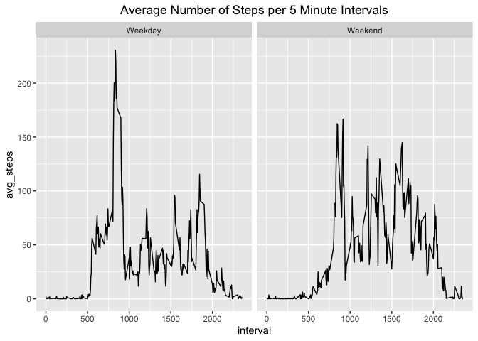

## Loading and preprocessing the data


```r
library(tidyverse)
```

```
## ── Attaching packages ─────────────────────────────────────── tidyverse 1.3.0 ──
```

```
## ✓ ggplot2 3.3.2     ✓ purrr   0.3.4
## ✓ tibble  3.0.4     ✓ dplyr   1.0.2
## ✓ tidyr   1.1.2     ✓ stringr 1.4.0
## ✓ readr   1.4.0     ✓ forcats 0.5.0
```

```
## ── Conflicts ────────────────────────────────────────── tidyverse_conflicts() ──
## x dplyr::filter() masks stats::filter()
## x dplyr::lag()    masks stats::lag()
```

```r
df1 <- read_csv("activity.zip") %>%
        drop_na()
```

```
## 
## ── Column specification ────────────────────────────────────────────────────────
## cols(
##   steps = col_double(),
##   date = col_date(format = ""),
##   interval = col_double()
## )
```

## What is mean total number of steps taken per day?


```r
df1 <- df1 %>% 
        group_by(date) %>% 
        summarize(tot_steps = sum(steps)) 
```

```
## `summarise()` ungrouping output (override with `.groups` argument)
```

```r
df1 %>% 
        ggplot(aes(tot_steps)) +
        geom_histogram(binwidth = 600) + 
        ggtitle("Mean Daily Number of Steps") + 
        theme(plot.title = element_text(hjust=0.5))
```

<!-- -->

```r
mean_steps <- round(df1 %>% 
        summarise(mean_steps = mean(tot_steps)))

median_steps <- round(df1 %>% 
        summarise(median_steps = median(tot_steps)))

print(paste("The mean number of steps is",mean_steps, "and the median number of steps is",median_steps))
```

```
## [1] "The mean number of steps is 10766 and the median number of steps is 10765"
```

## What is the average daily activity pattern?


```r
df2 <- read_csv("activity.zip") 
```

```
## 
## ── Column specification ────────────────────────────────────────────────────────
## cols(
##   steps = col_double(),
##   date = col_date(format = ""),
##   interval = col_double()
## )
```

```r
df_int <- df2 %>% 
        group_by(interval) %>% 
        summarize(avg_steps = mean(steps,na.rm = TRUE))
```

```
## `summarise()` ungrouping output (override with `.groups` argument)
```

```r
plot_1 <- df_int %>% 
        ggplot(aes(x = interval, y = avg_steps)) +
        geom_line() + 
        ggtitle("Average Number of Steps per 5 Minute Intervals") + 
        theme(plot.title = element_text(hjust=0.5))

plot_1
```

<!-- -->

```r
interval_max<-df_int[which.max(df_int$avg_steps),][1]
steps_max<-round(df_int[which.max(df_int$avg_steps),][2])


print(paste(interval_max, "is the interval with the highest number of steps,", "which has an average of",steps_max,"steps."))
```

```
## [1] "835 is the interval with the highest number of steps, which has an average of 206 steps."
```


## Imputing missing values


```r
#Calculate and report the total number of missing values in the dataset (i.e. the total number of rows with \color{red}{\verb|NA|}NAs)
sum(is.na(df2$steps))
```

```
## [1] 2304
```

```r
df_impute <- df2 %>%
        group_by(interval) %>%
        mutate(steps = ifelse(is.na(steps), mean(steps, na.rm = TRUE), steps))

# Make a histogram of the total number of steps taken each day and Calculate and report the mean and median total number of steps taken per day. 
#Do these values differ from the estimates from the first part of the assignment? 
#What is the impact of imputing missing data on the estimates of the total daily number of steps?

plot_hist_impute <- df_impute %>% 
        group_by(date) %>% 
        summarize(tot_steps = sum(steps)) %>%
        ggplot(aes(tot_steps)) +
        geom_histogram(binwidth = 500) +         
        ggtitle("Average Daily Number of Steps After Imputation") + 
        theme(plot.title = element_text(hjust=0.5))
```

```
## `summarise()` ungrouping output (override with `.groups` argument)
```

```r
plot_hist_impute
```

<!-- -->

```r
#mean/median
df_impute_dt <- df_impute %>% 
        group_by(date) %>% 
        summarise(tot_steps = sum(steps)) 
```

```
## `summarise()` ungrouping output (override with `.groups` argument)
```

```r
mean_steps_i <- round(df_impute_dt %>% 
        summarise(mean_steps = mean(tot_steps)))
median_steps_i <- round(df_impute_dt %>% 
        summarise(median_steps  = median(tot_steps)))

print(paste("The mean number of steps after imputing is",mean_steps_i, "and the median number of steps after inputing is",median_steps_i))
```

```
## [1] "The mean number of steps after imputing is 10766 and the median number of steps after inputing is 10766"
```


## Are there differences in activity patterns between weekdays and weekends?


```r
df_impute <- df_impute %>% 
        mutate(weekend = fct_collapse(weekdays(date),
                     Weekend = c("Saturday", "Sunday"),
                     Weekday = c("Monday","Tuesday","Wednesday","Thursday","Friday"))
        )
        
#Plot weekend vs. weekday

df_impute_plot <- df_impute %>% 
        group_by(interval,weekend) %>% 
        summarize(avg_steps = mean(steps,na.rm = TRUE))
```

```
## `summarise()` regrouping output by 'interval' (override with `.groups` argument)
```

```r
plot_3 <- df_impute_plot %>% 
        ggplot(aes(x = interval, y = avg_steps)) +
        geom_line() + 
        facet_grid(~ weekend) + 
        ggtitle("Average Number of Steps per 5 Minute Intervals") + 
        theme(plot.title = element_text(hjust=0.5))
        
plot_3
```

<!-- -->
